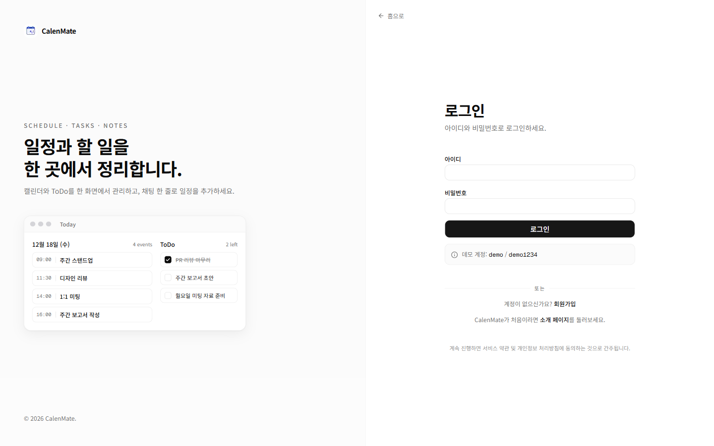
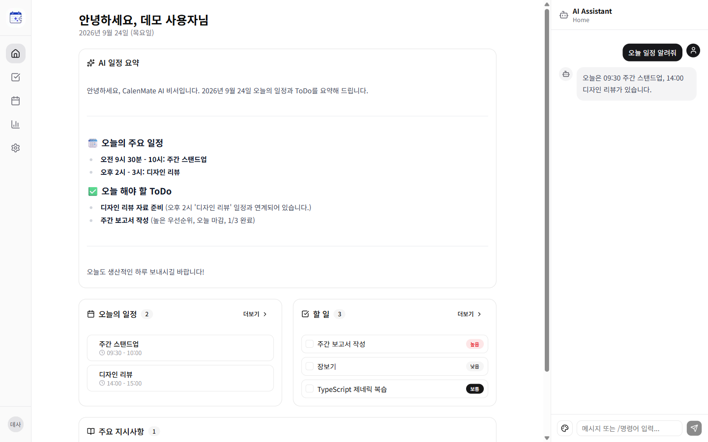
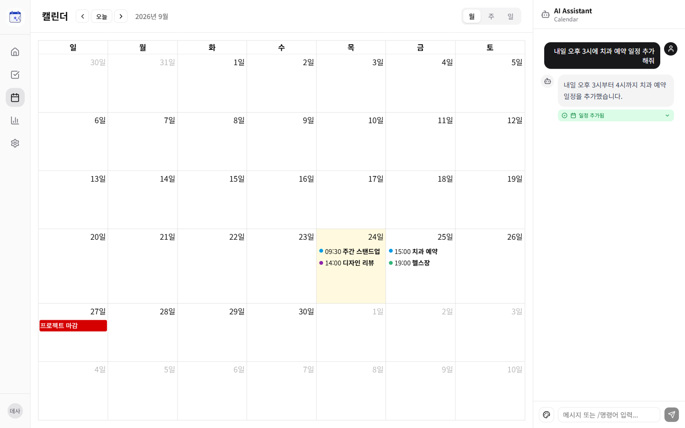
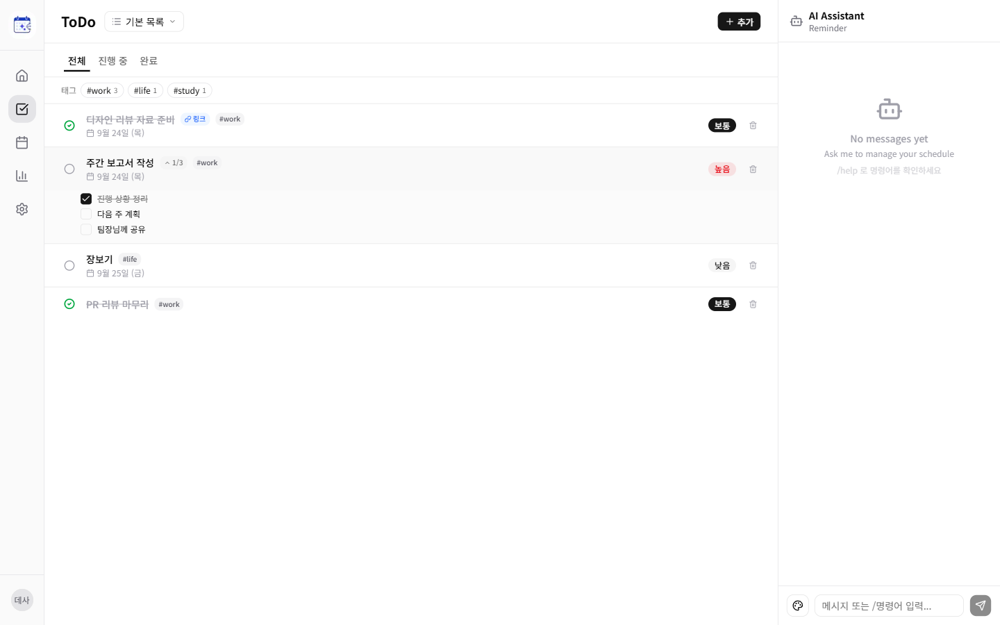
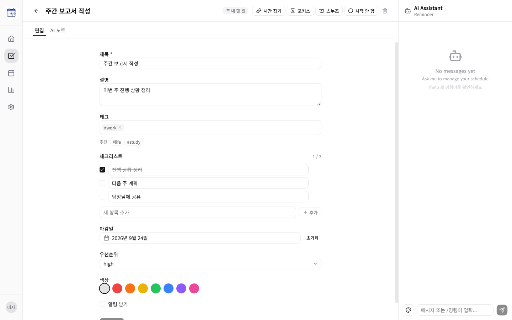
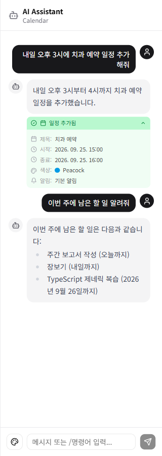
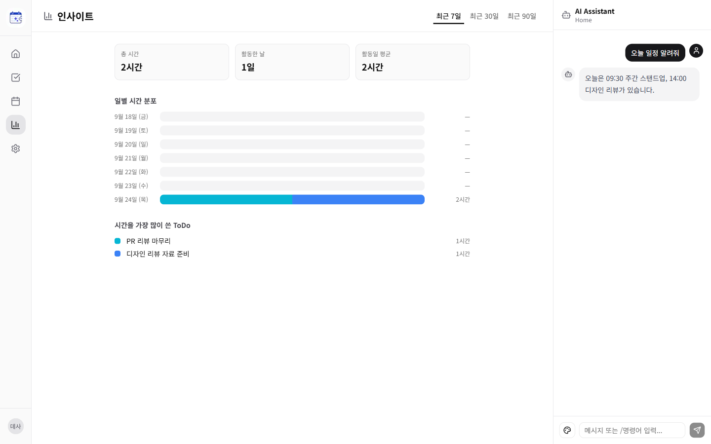

<div align="center">

# 📅 CalenMate

**A calendar and ToDo manager you can control by chatting with an AI**

[](https://opensource.org/licenses/MIT)
[](https://www.typescriptlang.org/)
[](https://nextjs.org/)
[](https://expressjs.com/)
[](https://www.postgresql.org/)
[](https://www.docker.com/)

**English** | [한국어](./README.ko.md)


</div>

---

## 📌 Project Status

Development on this project has stopped. The ideas were carried over into two follow-up projects:

- [**SERVER**](https://github.com/Zanviq/SERVER) — a personal multi-user home server (FastAPI + React, Docker) that includes calendar, ToDo and an AI assistant
- [**Plant-Counselor**](https://github.com/Zanviq/Plant-Counselor) — an AI gardener web service that represents worries, goals and schedules as a plant's life cycle

---

## 💭 Developer's Note

> <!-- TODO: one-line quote -->

<!-- TODO: development motivation (1–3 paragraphs, first person) -->

---

## ✨ Features

### 💬 AI Chat Assistant
- Uses Gemini 2.5 Flash with JSON output; one message can run several actions (create/update/delete events and ToDos, change status, link events, save instructions)
- The prompt includes the next 7 days of events, open and recently completed ToDos, the last 40 chat messages and saved instructions
- If a question is about another date range, the AI requests that range first (`query_events`) and answers with it
- Bulk actions (deleting or editing several items, scheduling several ToDos into free time slots at once) are shown as pending and run only after the user presses confirm
- Chat history is kept per tab (home / calendar / ToDo); slash commands such as `/today`, `/reminders`, `/clear`

### 📅 Calendar
- Month / week / day views (FullCalendar); click a date to see that day's events or add one
- Events are stored in PostgreSQL; 11 color presets
- Events can also be added, moved or deleted from the chat

### ✅ ToDo
- ToDos belong to lists (a default list is created at sign-up)
- Three states (not started / in progress / done), priority, due date, tags (AND filter) and a checklist
- Snooze moves the due date to tomorrow, next week or next Monday
- A ToDo can be linked to an event or given a new time block; when the event starts or ends, its status updates the next time it is read (no background worker)

### 📝 Notes and Focus Sessions
- Each ToDo has one Markdown note; the AI can write a draft
- Focus timer (25 / 50 min) marks the ToDo as in progress and can complete it when stopped
- The Insights page adds up time per day from ToDo start/finish times and focus sessions

### 🏠 Home Summary
- AI summary of today's events and open ToDos (cached for 15 minutes, cleared when data changes)
- Today's events, open ToDos and saved AI instructions on one screen

### 🔐 Accounts and Self-Hosting
- Username + password sign-up; passwords hashed with bcrypt, session kept in an httpOnly JWT cookie
- Every query is filtered by the logged-in user ([docs/authorization.md](docs/authorization.md))
- `docker compose up` starts PostgreSQL, the backend and the frontend; migrations and demo data are applied on start

---

## 🚀 Getting Started

### Prerequisites
- [Docker](https://docs.docker.com/get-docker/) with Docker Compose v2
- [Google Gemini API Key](https://aistudio.google.com/app/apikey) (needed only for AI features; the rest of the app works without it)

### Installation

```bash
# Clone repository
git clone https://github.com/Zanviq/CalenMate.git
cd CalenMate

# Create the env file, then set JWT_SECRET and GEMINI_API_KEY
cp .env.example .env

# Build and start (db, backend, frontend)
docker compose up --build
```

Open http://localhost:3000.

### Demo Account

| ID | Password |
|:---:|:---:|
| `demo` | `demo1234` |

The demo account comes with sample events, ToDos, a note and an instruction. Set `SEED_DEMO_DATA=false` in `.env` to skip it.

### Environment Variables

| Variable | Description |
|----------|-------------|
| `JWT_SECRET` | Key used to sign the session cookie (e.g. `openssl rand -hex 32`) |
| `GEMINI_API_KEY` | Gemini API key for chat, summary and AI notes |
| `APP_PORT` | Port for the web app (default `3000`) |
| `POSTGRES_USER` / `POSTGRES_PASSWORD` / `POSTGRES_DB` | Database settings |
| `COOKIE_SECURE` | `true` when served over HTTPS |
| `SEED_DEMO_DATA` | Create the demo account on start (default `true`) |

---

## 🛠️ Tech Stack

| Category | Technology |
|----------|------------|
| **Frontend** | Next.js 16 (App Router), React 19, TypeScript |
| **UI** | Tailwind CSS v4, shadcn/ui, FullCalendar |
| **State** | Zustand, TanStack Query |
| **Backend** | Express 5, TypeScript, Zod |
| **Database** | PostgreSQL 16, Drizzle ORM |
| **Auth** | bcryptjs, jsonwebtoken (httpOnly cookie) |
| **AI** | Google Gemini API (gemini-2.5-flash) |
| **Infra** | Docker Compose, multi-stage Dockerfiles |

---

## 📁 Project Structure

```
CalenMate/
├── 📂 backend/
│   ├── 📂 drizzle/              # SQL migrations (generated by drizzle-kit)
│   ├── 📂 src/
│   │   ├── 📂 db/
│   │   │   ├── schema.ts        # Table definitions
│   │   │   ├── migrate.ts       # Applies migrations on start
│   │   │   └── seed.ts          # Demo account and sample data
│   │   ├── 📂 middleware/
│   │   │   ├── auth.ts          # JWT cookie check, sets req.userId
│   │   │   └── validate.ts      # Zod request validation
│   │   ├── 📂 routes/           # auth, calendar, reminders, chat, summary, focus, insights ...
│   │   ├── 📂 services/
│   │   │   ├── gemini.ts        # Prompts, retry, JSON parsing
│   │   │   ├── events.ts        # Calendar events
│   │   │   ├── reminders.ts     # ToDo operations shared by routes and chat
│   │   │   └── task-lists.ts    # ToDo lists
│   │   └── index.ts             # Express app, startup
│   └── Dockerfile
├── 📂 frontend/
│   ├── 📂 src/
│   │   ├── 📂 app/              # Pages: login, home, calendar, reminders, insights, settings
│   │   ├── 📂 components/       # App shell, chat panel, calendar/ToDo dialogs, ui/
│   │   ├── 📂 store/            # Zustand stores (auth, chat)
│   │   ├── 📂 lib/api.ts        # Axios client (same-origin /api)
│   │   └── proxy.ts             # Redirects based on the session cookie
│   ├── next.config.ts           # /api rewrite to the backend, standalone output
│   └── Dockerfile
├── 📂 docs/
│   └── authorization.md         # Per-user access rules
├── docker-compose.yml           # db, backend, frontend
└── .env.example                 # Environment variable template
```

---

## 💡 How to Use

1. **Log in**: Sign in with `demo` / `demo1234`, or create an account with "회원가입"
2. **Ask the AI**: Type in the chat panel on the right, e.g. "내일 오후 3시에 치과 일정 추가해줘"
3. **Add an event**: On the calendar, click a date and fill in the form
4. **Manage ToDos**: On the ToDo page, add items, pick a list, filter by tag, and click the circle to change status
5. **Block time**: On a ToDo's detail page, link an existing event or create a time block
6. **Focus**: On a ToDo's detail page, start a 25- or 50-minute focus session
7. **Check your time**: See daily time totals on the Insights page

---

## 🎨 Screenshots

<div align="center">



<table>
  <tr>
    <td></td>
    <td></td>
  </tr>
  <tr>
    <td></td>
    <td></td>
  </tr>
  <tr>
    <td></td>
    <td></td>
  </tr>
</table>
</div>

---

## 📝 License

This project is distributed under the MIT License. See [LICENSE](LICENSE) for details.

---

<div align="center">

| 👤 **Developer** | ✉️ **Email** |
|:---:|:---:|
| Zanviq | zanviq.dev@gmail.com |

</div>
